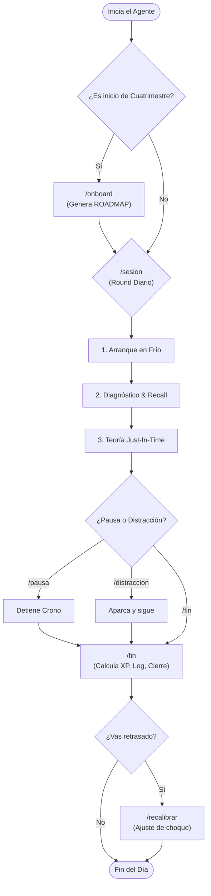

<div align="center">

# ⛩️ 會長 · Kaichō
### El Coach de Estudio de Élite para Agentes de IA

**Sistema de _context engineering_ que convierte a tu agente de código (Claude Code, Codex, Antigravity) en un implacable entrenador de exámenes: determinista, agnóstico y guiado por evidencia científica.**

[](LICENSE)
[](#-soporte-tri-tool)
[](#-soporte-tri-tool)
[](#-soporte-tri-tool)
[](#-pedagogía-y-gamificación)

*Kaichō no es un prompt. No es un chatbot. Es una arquitectura de comportamiento.*

---
</div>

## 📖 Índice

- [Por qué existe](#-por-qué-existe)
- [Tesis de diseño](#-tesis-de-diseño)
- [Inicio rápido](#-inicio-rápido)
- [El Flujo Maestro](#-el-flujo-maestro)
- [Soporte Tri-Tool (Comandos)](#-soporte-tri-tool)
- [Pedagogía y Gamificación](#-pedagogía-y-gamificación)
- [Estructura y Privacidad](#-estructura-y-privacidad)
- [Créditos y Filosofía](#-créditos-y-filosofía)

---

## ⚡ Por qué existe

El aprendizaje humano tiene un fallo de fábrica: tendemos a evitar la fricción. Rendimos bien en el trabajo práctico, pero ante un examen teórico caemos en el **estudio pasivo** (releer, subrayar), que genera una *ilusión de competencia* sin retención real.

Kaichō trata este modo de fallo como un **problema de ingeniería**. Corrige el patrón humano *por construcción*:
1. **Fuerza la recuperación activa** en frío antes de permitirte leer.
2. **Ataca el formato real** del examen, no el temario lineal.
3. **Hace innegociable el progreso**, midiendo resultados, no horas en la silla.

<p align="center">
  
  <br><sub>La tesis del sistema en una imagen: <b>fallar en frío es entrenamiento; no intentarlo es el único fracaso real.</b><br>Cada sesión empieza por la hoja en blanco para asegurarte de estar en el lado izquierdo.</sub>
</p>

---

## 🧠 Tesis de diseño

Kaichō está construido sobre principios irrompibles.

| Principio | Decisión |
| :--- | :--- |
| 🎯 **Agnóstico y Universal** | La inteligencia vive en `methodology/`. Se ejecuta idéntico en Claude Code, Codex y Antigravity. |
| 🔒 **Fidelidad del Examen** | Si hay imágenes o diagramas, **prohibido pre-interpretar**. El agente te manda al original. |
| ⚔️ **Anti-Overfitting** | **Regla de los 2 exámenes**: No vas al examen real sin dominar 2 exámenes anteriores. |
| ⏱️ **Control por Ítems** | El día no se mide en horas, se mide en *ítems cerrados bajo un cronómetro estricto* (TIMEOUT). |
| 🛡️ **Seguridad Local** | Tus apuntes, PDFs y progreso nunca se suben. El repo público es solo la plantilla. |

---

## 🚀 Inicio rápido

Entrena en menos de 5 minutos. Sin servidores. Sin dependencias. 

```bash
# 1. Obtén el sistema (o haz un fork)
git clone https://github.com/hoodrichpirobo/kaicho.git && cd kaicho

# 2. Lanza tu agente favorito en esta carpeta
claude        # Para Claude Code
codex         # Para Codex
agy           # Para Antigravity / Gemini CLI
```

Una vez dentro de tu agente, el flujo es secuencial:

1. **El Perfil:** `/setup` *(o escribe "empezar")* — Crea tu perfil psicológico y global.
2. **El Semestre:** `/onboard` *(o "monta el cuatrimestre")* — Analiza las guías docentes y te traza un `ROADMAP.md` a medida.
3. **El Día a Día:** `/sesion` *(o "vamos a entrenar")* — El agente decide qué toca hoy y lanza el round. Cierra con `/fin`.

---

## 🗺️ El Flujo Maestro

Toda la complejidad recae en el sistema. Tu día a día es brutalmente simple.



---

## 🛠️ Soporte Tri-Tool

Tres ecosistemas, una sola metodología. Kaichō detecta qué agente usas y te ofrece una integración perfecta.
**En todos ellos, basta con escribir la frase en lenguaje natural ("vamos a entrenar") para activar el flujo.**

| Acción | 🔴 Claude Code | 🟣 Codex | 🔵 Antigravity | Lenguaje natural |
| :--- | :--- | :--- | :--- | :--- |
| **Perfil global** | `/kaicho:setup` | `$setup` | `/setup` | *"empezar"* |
| **Alta del semestre** | `/kaicho:onboard` | `$onboard` | `/onboard` | *"monta el cuatrimestre"* |
| **Round de estudio** | `/kaicho:sesion` | `$sesion` | `/sesion` | *"vamos a entrenar"* |
| **Parar / Reanudar** | `/kaicho:pausa` / `:reanudar` | `$pausa` / `$reanudar`| `/pausa` / `/reanudar` | *"para el crono"* / *"seguimos"* |
| **Matar distracción** | `/kaicho:distraccion` | `$distraccion` | `/distraccion` | *"me he distraído"* |
| **Fin de round** | `/kaicho:fin` | `$fin` | `/fin` | *"fin de sesión"* |
| **Ajuste de realidad** | `/kaicho:recalibrar` | `$recalibrar` | `/recalibrar` | *"voy mal de tiempo"* |

> **Detalles de Implementación:**
> - **Claude Code:** Slash commands nativos en `.claude/commands/`.
> - **Codex:** Agent Skills cargadas como menciones `$nombre` o selección TUI.
> - **Antigravity:** Slash commands dinámicos (`/nombre`) y activación semántica profunda desde `.agents/skills/`. Ambos comparten `AGENTS.md` como reglas globales.

---

## 🧬 Pedagogía y Gamificación

Las políticas del sistema están cableadas según el marco de **_Make It Stick: The Science of Successful Learning_**:

*   🧠 **Testing Effect:** Recuperar en frío consolida la memoria; releer no.
*   🔄 **Práctica Espaciada:** El sistema re-pregunta fallos pasados antes de avanzar.
*   🔥 **Dificultades Deseables:** El esfuerzo cognitivo incómodo es la única métrica de aprendizaje real.

**El Marcador (`PROGRESO.md`)**
El sistema mantiene un estado gamificado local, pero **es implacable**:
No hay puntos por "esfuerzo pasivo" ni por "completar tutoriales". La Experiencia (XP), las subidas de rango (⬜→🟨→🟧) y los "Exámenes Dominados" solo se desbloquean logrando _accuracy_ en formato `ORIGINAL-FRÍO` (sin pistas ni preinterpretación por parte de la IA).

---

## 📁 Estructura y Privacidad

El repositorio es una plantilla. Tus datos son invisibles y se quedan en tu máquina.

```text
kaicho/
├── README.md
├── CLAUDE.md / AGENTS.md         ← Configuración de activación de agentes (Tool-agnostic)
├── .gitignore                    ← PROTEGE TUS DATOS. Ignora 'cuatrimestres/' y 'perfil/'
├── methodology/                  ← EL CEREBRO: 12 archivos de lógica irrompible
├── .claude/commands/kaicho/      ← Integración Claude
├── .agents/skills/               ← Integración Codex / Antigravity
├── scripts/                      ← CI/CD de Fidelidad (check-fidelidad-examen.sh)
├── perfil/                       ← Tu psicología (local)
└── cuatrimestres/                ← Tus apuntes, PDFs y logs (local)
```

Para validar que no has roto las reglas del sistema al editar la metodología, usa:
```bash
bash scripts/check-fidelidad-examen.sh
```

---

## 🏆 Créditos y Filosofía

* Estructura técnica inspirada en **[Orchestrator](https://github.com/imadrifai/orchestrator)**.
* Base científica extraída de **_Make It Stick_** (Brown, Roediger, McDaniel).
* Creado por CUX "INDIO" PRADA. Licencia MIT © 2026.

<br>

<p align="center">
  
  <br><sub><b>«Has subido de liga»</b> — el reencuadre maestro: sentirse el peor compitiendo arriba no es fracaso,<br>es el precio de competir donde se crece. El que pelea cuesta arriba es el fuerte.</sub>
</p>

<h3 align="center">Mejor sangrar en el entrenamiento que en el combate. 🩸</h3>
